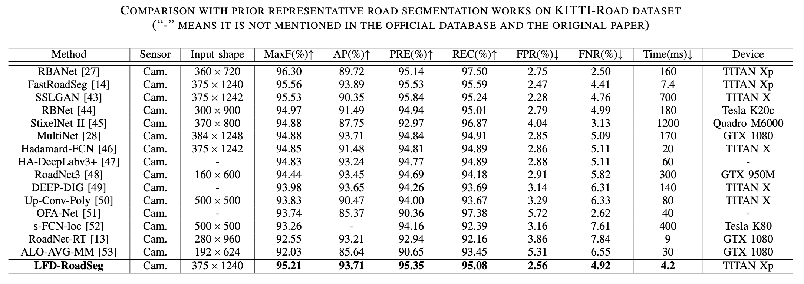

# ✨LFD-RoadSeg✨

> [**IEEE TITS**] **Exploiting Low-level Representations for Ultra-Fast Road Segmentation**
>
> by Huan Zhou, Feng Xue, Yucong Li, Shi Gong, Yiqun Li, Yu Zhou.
>

## Introduction
Achieving real-time and accuracy on embedded platforms has always been the pursuit of road segmentation methods. To this end, they have proposed many lightweight networks. However, they ignore the fact that roads are “stuff” (background or environmental elements) rather than “things” (specific identifiable objects), which inspires us to explore the feasibility of representing roads with low-level instead of high-level features. Surprisingly, we find that the primary stage of mainstream network models is sufficient to represent most pixels of the road for segmentation. Motivated by this, we propose a Low-level Feature Dominated Road Segmentation network (LFD-RoadSeg). Specifically, LFD-RoadSeg employs a bilateral structure. The spatial detail branch is firstly designed to extract low-level feature representation for the road by the first stage of ResNet-18. To suppress texture-less regions mistaken as the road in the low-level feature, the context semantic branch is then designed to extract the context feature in a fast manner. To this end, in the second branch, we asymmetrically downsample the input image and design an aggregation module to achieve comparable receptive fields to the third stage of ResNet-18 but with less time consumption. Finally, to segment the road from the low-level feature, a selective fusion module is proposed to calculate pixel-wise attention between the low-level representation and context feature, and suppress the non-road low-level response by this attention. On KITTI-Road, LFD-RoadSeg achieves a maximum F1-measure (MaxF) of 95.21% and an average precision of 93.71%, while reaching 238 FPS on a single TITAN Xp and 54 FPS on a Jetson TX2, all with a compact model size of just 936k parameters.

 

## Compare with other methods
 

## Installation

### 1. Clone the Git repo

``` shell
$ git clone https://github.com/zhouhuan-hust/LFD_RoadSeg.git
$ cd LFD_RoadSeg
```

### 2. Install dependencies

We implement this repo with the following environment:
- Python 3.9
- Pytorch 1.10.1
- CUDA 11.3

Install the other package via:
``` shell
pip install -r requirement.txt
```

### 3. Prepare dataset
- [KITTI Road](https://www.cvlibs.net/datasets/kitti/eval_road.php)
- The kitti dataset is used to generate the prediction results for the website online evaluation.
- The kittival dataset is used to conduct 5-fold cross-validation experiments.
- The kittival dataset is generated from the training data of the kitti dataset downloaded from the official website. The training data of kitti is divided into five parts, and each time, one part is selected as the test set, while the remaining four parts are used as the training set.


Put the datasets in `./data` folder.
#### Datasets structure

```
data
|--kitti
|    |--testing 
|    |   |--calib
|    |   |--image_2
|    |--training
|        |--calib
|        |--gt_image_2
|        |--image_2
|--kittival  
|    |--exp1 
|    |    |--test 
|    |    |   |--calib
|    |    |   |--gt_image_2
|    |    |   |--image_2
|    |    |--train
|    |        |--calib
|    |        |--gt_image_2
|    |        |--image_2
|    |--exp2
|    |--exp3
|    |--exp4
|    |--exp5
```


## Getting started
### Train

set training: state: True and run the code below:

```bash
python examples/LFDRoadseg_main.py 
```

### Val

set validating: state: True and run the code below:

```bash
python examples/LFDRoadseg_main.py 
```

### Test

set testing: state: True and run the code below:

```bash
python examples/LFDRoadseg_main.py 
```

### Eval Speed

set eval_speed: state: True and run the code below:

```bash
python examples/LFDRoadseg_main.py
```


## Citation

If you find this repo useful for your research, please consider citing our paper:

```bibtex
@ARTICLE{zhou2024lfdroadseg,
  author={Zhou, Huan and Xue, Feng and Li, Yucong and Gong, Shi and Li, Yiqun and Zhou, Yu},
  journal={IEEE Transactions on Intelligent Transportation Systems (TITS)}, 
  title={Exploiting Low-level Representations for Ultra-Fast Road Segmentation}, 
  year={2024},
  }
```

---
